# Introduction

::: {.absolute top="0" left="95%"}
::: sectionhead
1 [2 3 4]{style="opacity:0.25"}
:::
:::

---

## Background - South Levant in the Iron Age

::: {.absolute top="0" left="95%"}
::: {.sectionhead}
1 [2 3 4]{style="opacity:0.25"}
:::
:::

::: {.columns}

::: {.column width="45%"}
- Different interpretations of settlement dynamics in IA II
- Local kingdoms in IA I-IIA, then Assyrian conquest in VIII cent. BCE
- Narratives of Samaria and Judah as examples of the destructive nature of the Assyrian Empire

::: {.smallish}

| Arch. Periodization  | Dating (BC)   |
|-------------- | -------------- |
| Iron Age I    | 1150-980     |
| Iron Age IIa    | 980-830     |
| Iron Age IIb    | 830-720     |
| Iron Age IIc    | 720-539     |
| Iron Age III   | 539-333     |
: After @Palmisano.etal2019; @Sharon2013; @Mazar2011

:::

:::

::: {.column width="50%"}

:::

:::

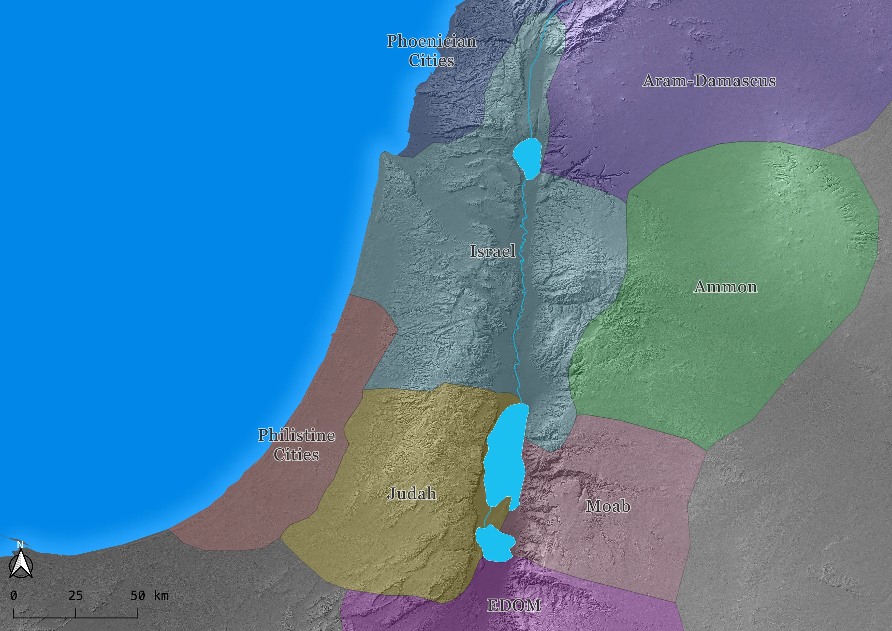{.absolute right="5%" top="15%" width="50%"}

::: {.fragment fragment-index=1}
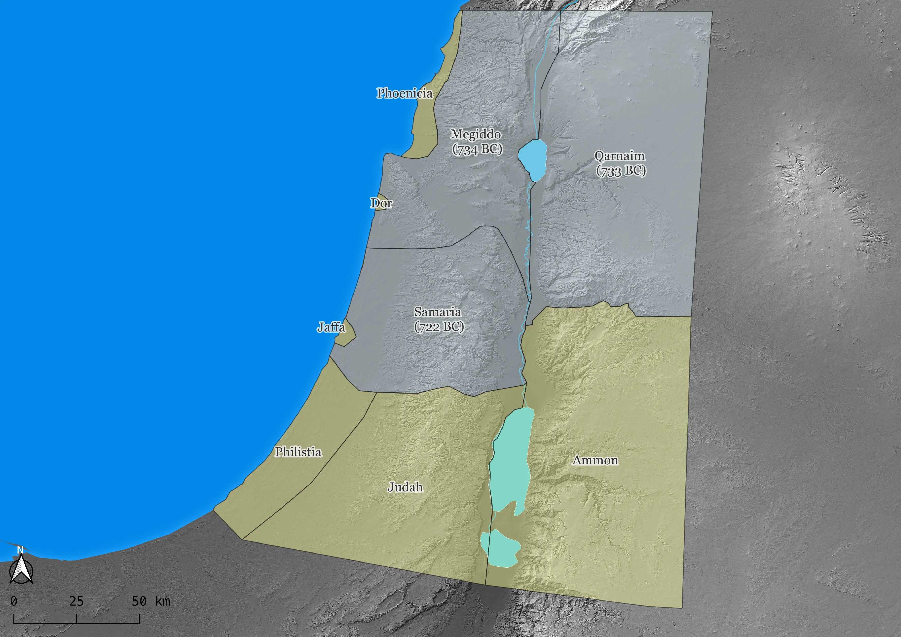{.absolute right="5%" top="15%" width="50%"}
:::

---

## Research Questions

::: {.absolute top="0" left="95%"}
::: {.sectionhead}
1 [2 3 4]{style="opacity:0.25"}
:::
:::

::: {.columns}

::: {.column width="50%"}

- **RQ 1**: What are the long-term demographic trends of the two sub-regions of Samaria and Judah and how they are related to climatic fluctuations?

- **RQ 2**: How can a long-term approach contribute to the ongoing debate on the Iron Age historical trajectories of the two sub-regions?
:::

::: {.column width="50%"}
{fig-align="center"}
:::

:::

---

## Aims

::: {.absolute top="0" left="95%"}
::: {.sectionhead}
1 [2 3 4]{style="opacity:0.25"}
:::
:::

::: {.columns}

::: {.column width="50%"}
- Reconstruct demographic fluctuations and the sub-regional level over a long range (6500-2200 BP)
- Evaluate cycles of climate-population relations
- Tackle the current debate on the Iron Age dynamics in the region

::: {.fragment fragment-index=1}
- Recently published as @Titolo.Palmisano2026
:::

:::

::: {.column width="50%"}
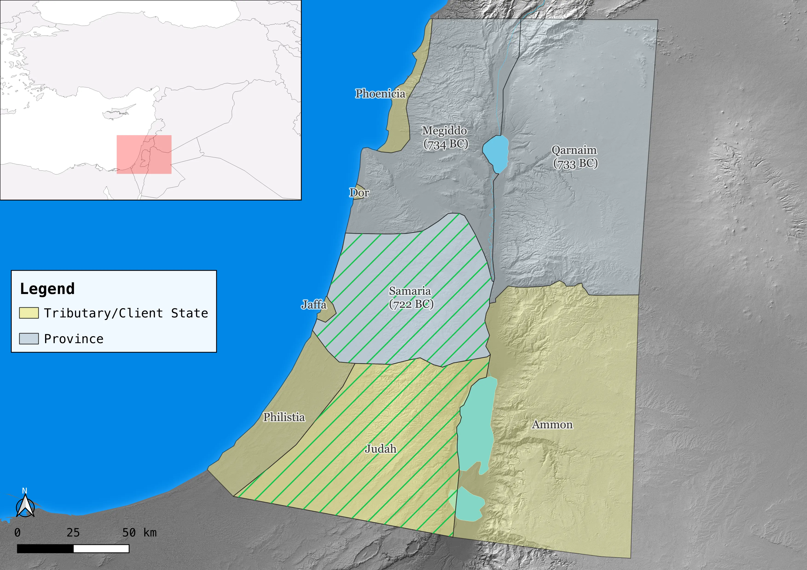
:::

:::

::: {.fragment fragment-index=1}
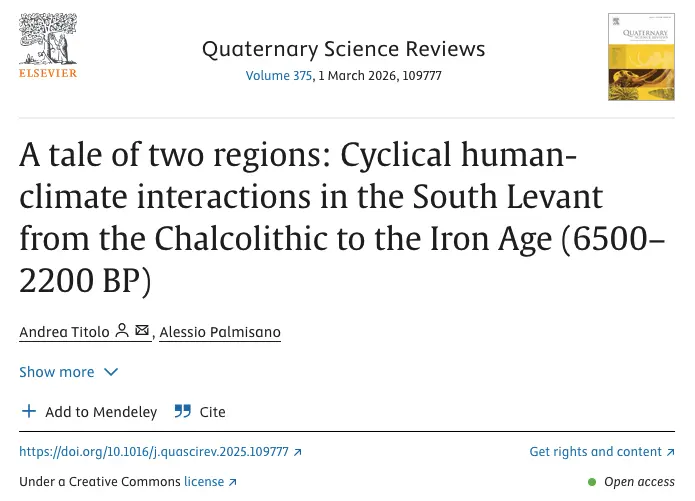{.absolute right="2%" top="9%" width="48%"}
{.absolute right="20%" top="70%" width="15%"}
:::

# Data and Methods

::: {.absolute top="0" left="95%"}
::: {.sectionhead}
[1]{style="opacity:0.25"} 2 [3 4]{style="opacity:0.25"}
:::
:::

---

## Data

::: {.absolute top="0" left="95%"}
::: {.sectionhead}
[1]{style="opacity:0.25"} 2 [3 4]{style="opacity:0.25"}
:::
:::

::: {.columns}

::: {.column width="50%"}

::: {.fragment fragment-index=1}
- Published dataset with high locational accuracy, size estimates, and an analysis-ready structure (6500-1312 BP) [@Titolo.Palmisano2025]
- Freely accessible at Zenodo [https://doi.org/10.5281/zenodo.15111732](https://doi.org/10.5281/zenodo.15111732)
:::

::: {.fragment fragment-index=2}
- Smaller subset for the time period 6500-2200 BP
- **3153** arch. sites and **6331** site-phases
- **1378** radiocarbon dates
- **4** Paleoclimate proxies
:::

::: {.fragment fragment-index=3}
- Limitations: temporal uncertainty, data distribution and quality
:::

:::

::: {.column width="50%"}

:::

:::

::: {.fragment fragment-index=2 .fade-in-then-out}
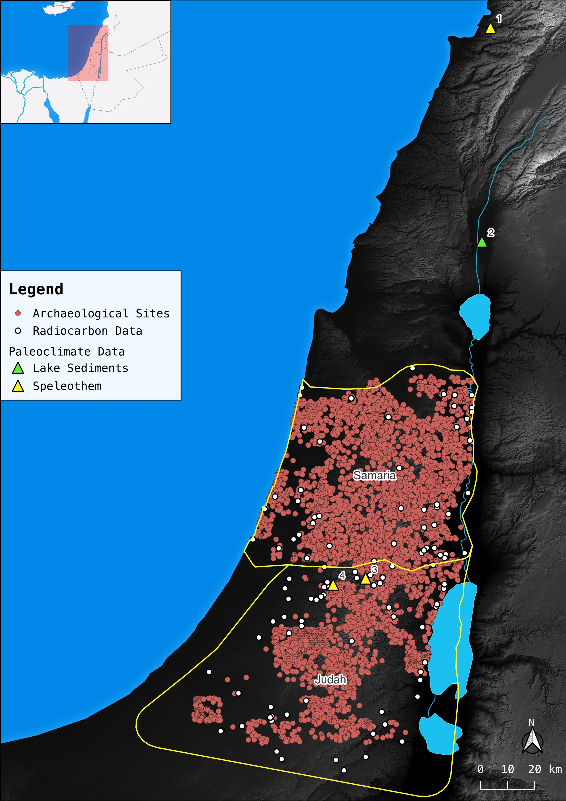{.absolute right="8%" top="6%" width="38%"}
:::

::: {.fragment fragment-index=3}
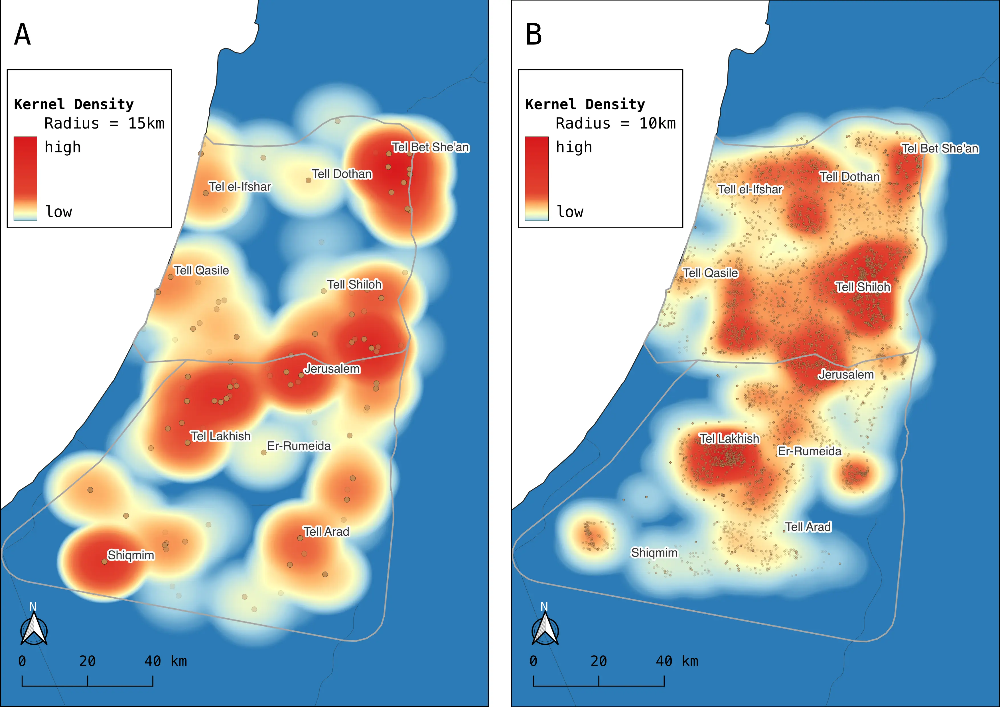{.absolute right="0%" top="20%" width="50%"}
:::

::: {.fragment fragment-index=1 .fade-in-then-out}
{.absolute right="1%" top="15%" width="50%"}
{.absolute right="15%" top="50%" width="25%"}
:::

---

## Methods

::: {.absolute top="0" left="95%"}
::: {.sectionhead}
[1]{style="opacity:0.25"} 2 [3 4]{style="opacity:0.25"}
:::
:::

::: {.columns}

::: {.column width="50%"}
- Probabilistic methods to account for data limitation:
    - Time-blocks of 100 years
    - SPDs and cKDE for radiocarbon dates
    - Aoristic Sum/Weight and Monte-Carlo Randomization for arch. sites [@Crema2012; @Crema2022]
    - Multiproxy approach (raw site counts, site extent, aoristic weight, random curve) [@Lawrence.etal2021; @Palmisano.etal2019]

::: {.fragment fragment-index=1}
- Z-Score D18O and moving window correlation [@Finne.etal2019; @Roberts2021]
:::

:::

::: {.column width="50%"}

:::

:::

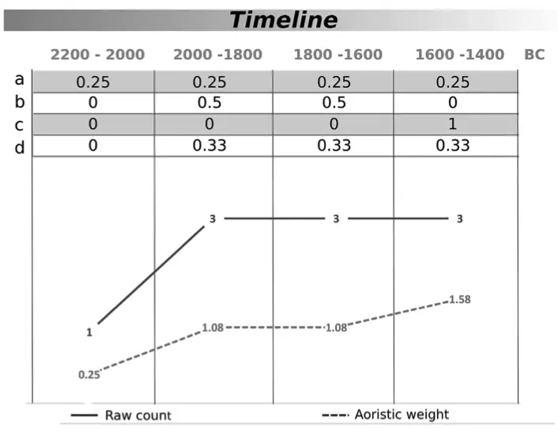{.absolute right="3%" top="15%" width="45%"}

::: {.fragment fragment-index=1}
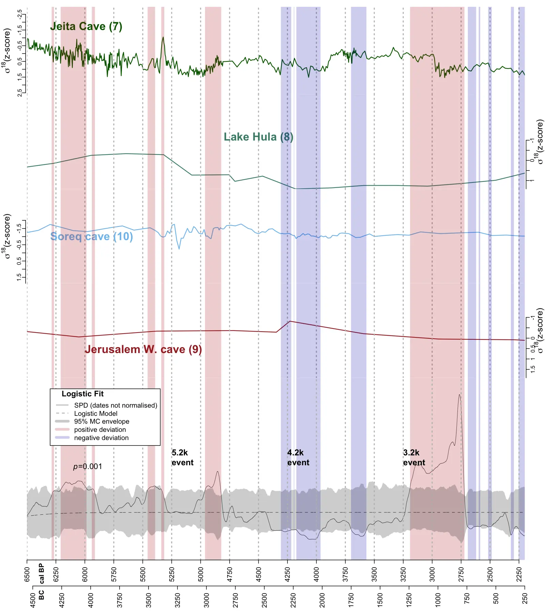{.absolute right="2%" top="10%" width="45%"}
:::

# Results and Discussion

::: {.absolute top="0" left="95%"}
::: {.sectionhead}
[1 2]{style="opacity:0.25"} 3 [4]{style="opacity:0.25"}
:::
:::

## Archaeo-demographic Proxies

::: {.absolute top="0" left="95%"}
::: {.sectionhead}
[1 2]{style="opacity:0.25"} 3 [4]{style="opacity:0.25"}
:::
:::

::: {.columns}

::: {.column width="40%"}
- Combined SPDs and cKDE [@Crema2022; @McLaughlin2019]
- "Booms and busts":
    - Positive trend in Chalcolithic, EBA, and Iron Age
    - Negative trend in MBA (from 4300 BP)
- The drop after 2700 BP is likely artificial - Hallstat Plataeu [@Plicht2004]
:::

::: {.column width="60%"}
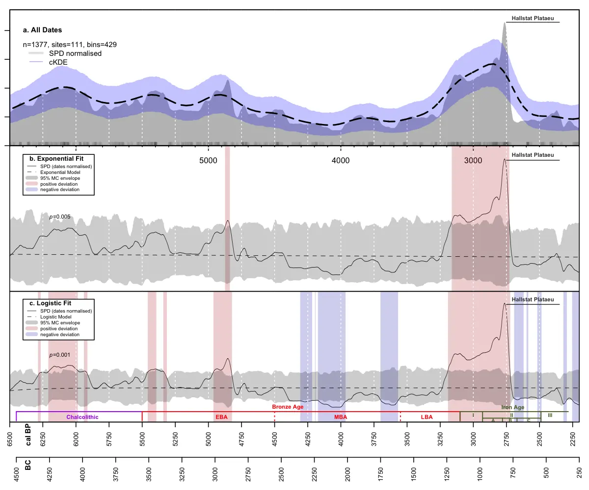
:::

:::

---

## Regional Variations

::: {.absolute top="0" left="95%"}
::: {.sectionhead}
[1 2]{style="opacity:0.25"} 3 [4]{style="opacity:0.25"}
:::
:::

::: {.columns}

::: {.column width="40%"}
- Permutation Test [@Crema.etal2016]
- Measures the sub-regional divergences from the regional curve, accounting for sample size
- SPDs do not show any difference between Samaria and Judah
- Statistically significant deviations only in EBA
:::

::: {.column width="60%"}
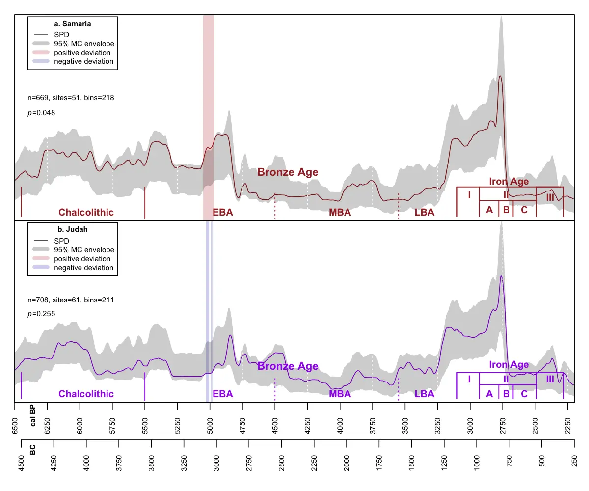
:::

:::

---

## Multi-proxy results

::: {.absolute top="0" left="95%"}
::: {.sectionhead}
[1 2]{style="opacity:0.25"} 3 [4]{style="opacity:0.25"}
:::
:::

::: {.columns}

::: {.column width="40%"}
- Archaeo-demographic proxies generally agree on most parts of the investigated time-frame
- **Samaria**: population booms in Chalcolithic and EBA I-II, decline in EBA II-III, stagnation in IBA and peak in MBA II
- **Judah**: After cycles between Chalcolithic and EBA II, gradual decline until MBA II. Closer to SPDs.
- Both: increase in IA I, decline during IA II-III, with different timings
:::

::: {.column width="60%"}

:::

:::

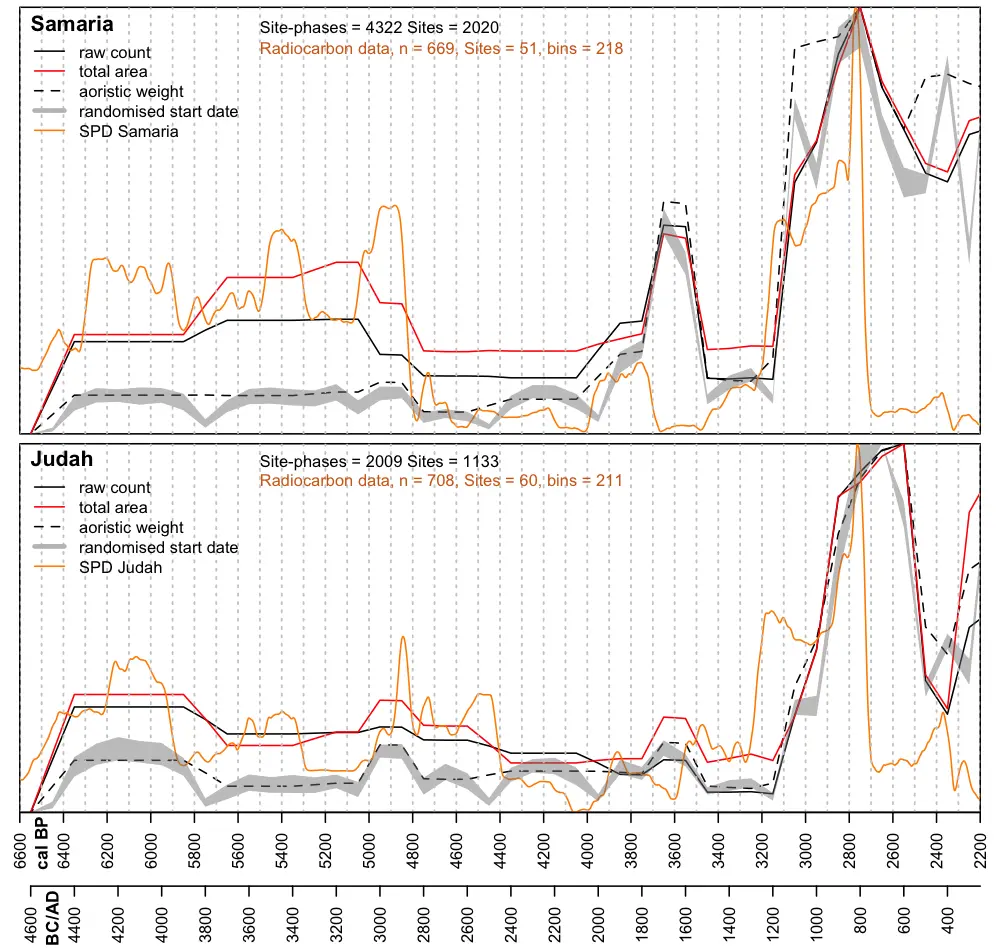{.absolute right="5%" top="9%" width="52%"}

---

## Paleoclimate and Demography

::: {.absolute top="0" left="95%"}
::: {.sectionhead}
[1 2]{style="opacity:0.25"} 3 [4]{style="opacity:0.25"}
:::
:::

::: {.columns}

::: {.column width="40%"}
- Cyclical relationship

::: {.fragment fragment-index=1}
- Five 750-year regular cycles from 6250 to 2500 BP
- First four shows positive correlation between climate and population
- Final cicle (3250–2500 BP) displays a negative correlation (decoupling)
:::

:::

::: {.column width="60%"}
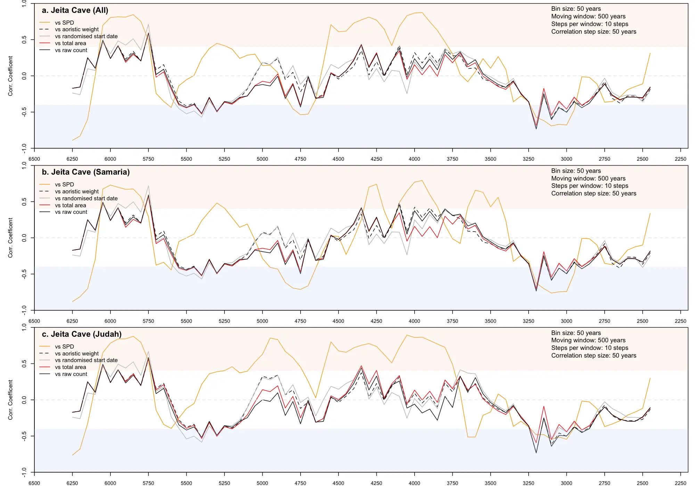{fig-align="center"}
:::

:::

::: {.fragment fragment-index=1 style="color:red"}
::: {.absolute right="47%" top="22%"}
1
:::
::: {.absolute right="39%" top="10%"}
2
:::
::: {.absolute right="27%" top="22%"}
3
:::
::: {.absolute right="17%" top="22%"}
4
:::
::: {.absolute right="10%" top="15%"}
5
:::
:::

---

## Discussion - Climate and Population

::: {.absolute top="0" left="95%"}
::: {.sectionhead}
[1 2]{style="opacity:0.25"} 3 [4]{style="opacity:0.25"}
:::
:::

::: {.fragment fragment-index=1 .fade-in-then-semi-out}
- What are the long-term demographic trends of the two sub-regions of Samaria and Judah and how they are related to climatic fluctuations?
:::

::: {.columns}

::: {.column width="50%"}

::: {.fragment fragment-index=2}
- Cyclical correlations, but climatic conditions are likely not the only explanation
- Hinted by the generally low correlations
:::

:::

::: {.column width="50%"}

:::

:::

::: {.fragment fragment-index=2}
{.absolute right="0%" top="25%" width="50%"}
:::

---

## Discussion - Climate and Population

::: {.absolute top="0" left="95%"}
::: {.sectionhead}
[1 2]{style="opacity:0.25"} 3 [4]{style="opacity:0.25"}
:::
:::

::: {.columns}

::: {.column width="50%"}

::: {.body-smaller}
| Region  | 5.2k   | 4.2k   | 3.2k   |
|-------------- | -------------- | -------------- | -------------- |
| Samaria    |  moderate     | severe     | negligible     |
| Judah    | moderate     | severe     | negligible     |
:::

 

::: {.incremental}
- 5.2k: moderate effect, higher societal resilience and partial mitigation from irrigation technologies [@Chesson2018]
- 4.2k: more substantial, but **gradual decline** and lower resilience [@Marston2023], return to more sustainable population levels, not a sudden collapse
- 3.2k: minor effects, population increase and clear **decoupling**
:::

:::

::: {.column width="50%"}

:::

:::

{.absolute right="2%" top="12%" width="45%"}

---

## Discussion - The Iron Age II

::: {.absolute top="0" left="95%"}
::: {.sectionhead}
[1 2]{style="opacity:0.25"} 3 [4]{style="opacity:0.25"}
:::
:::

::: {.fragment fragment-index=1 .fade-in-then-semi-out}
- How can a long-term approach contribute to the ongoing debate on the Iron Age historical trajectories of the two sub-regions?
:::

::: {.columns}

::: {.column width="50%"}
::: {.fragment fragment-index=2}
- **Samaria**: decline in ∼2670 BP less substantial than what usually described
- Imperial settlement restructure after kingdom of Israel
- Context: occupation of specific regions ("islands of control") and ruralization
:::

:::

::: {.column width="50%"}

:::

:::

::: {.fragment fragment-index=2}
{.absolute right="0%" top="17%" width="49%"}
:::

---

## Discussion - The Iron Age II

::: {.absolute top="0" left="95%"}
::: {.sectionhead}
[1 2]{style="opacity:0.25"} 3 [4]{style="opacity:0.25"}
:::
:::

::: {style="opacity:0.25"}
- How can a long-term approach contribute to the ongoing debate on the Iron Age historical trajectories of the two sub-regions?
:::

::: {.columns}

::: {.column width="50%"}

- **Judah**: more gradual growth (∼ 2600 BP) and later, but more substantial decline, combination of:
- Settlement expansion, imperial control of the arabian trade, political stability
- High-risk high-gain local economy, and "overshoot" [@Cumming.Peterson2017; @Marston2023; @Roberts2021]

:::

::: {.column width="50%"}

:::

:::

{.absolute right="0%" top="17%" width="49%"}

# Conclusions

::: {.absolute top="0" left="95%"}
::: {.sectionhead}
[1 2 3]{style="opacity:0.25"} 4
:::
:::

## Conclusions

::: {.absolute top="0" left="95%"}
::: {.sectionhead}
[1 2 3]{style="opacity:0.25"} 4
:::
:::

::: {.columns}

::: {.column width="60%"}
::: {.incremental}
- The sub-regional lens coupled with a high-quality dataset can reveal more **nuanced** patterns than a regional analysis
- The multiproxy approach reveals positive **cycles** of climate-settlement relations, until the **decoupling** in the Iron Age
- The decline visible in Samaria is **nowhere near** the scenario of desolation depicted by a certain biblical narrative
:::
:::

::: {.column width="40%"}

:::

:::

---

## Conclusions

::: {.absolute top="0" left="95%"}
::: {.sectionhead}
[1 2 3]{style="opacity:0.25"} 4
:::
:::

::: {.columns}

::: {.column width="50%"}
Next Steps:

- Long-term settlement patterns and systems (_in preparation_)
  - Aspects of centralisation, spatial distribution, and political integration
- Adaptive Cycles models within Resilience theory framework
:::

::: {.column width="50%"}
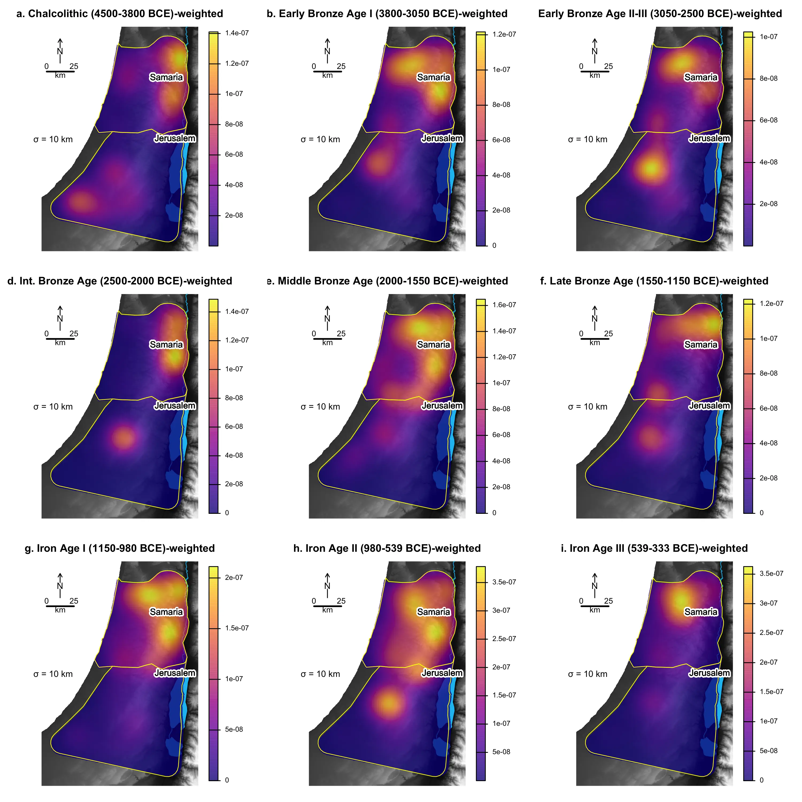
:::

:::

# Thank you for your attention! {background-image="img/background-gis-plain.webp" background-opacity="35%" style="text-align:center"}

 

Andrea Titolo ([andrea.titolo@unito.it](mailto:andrea.titolo@unito.it)) -  [0000-0002-7322-8634](https://orcid.org/0000-0002-7322-8634)

Alessio Palmisano ([alessio.palmisano@unito.it](mailto:alessio.palmisano@unito.it)) - 
[0000-0003-0758-5032](https://orcid.org/0000-0003-0758-5032)

 

::: {.columns}

::: {.column width="50%"}
Read the paper:

{width="30%"}
:::

::: {.column width="50%"}
Download the presentation:

:::

:::

 

  [https://doi.org/10.5281/zenodo.19126661](https://doi.org/10.5281/zenodo.19126661)

  [Slides Source Code](https://github.com/UnitoAssyrianGovernance/lac2026) - [CC BY-SA-4.0](https://creativecommons.org/licenses/by-sa/4.0/)

# References
